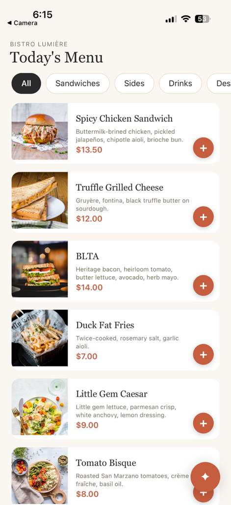
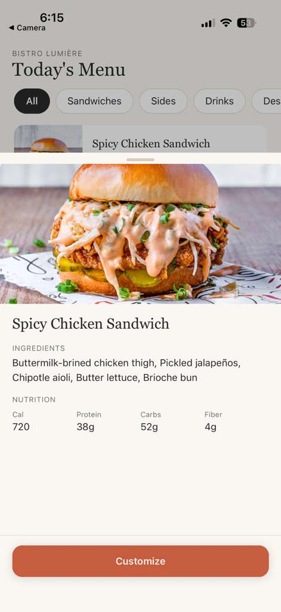
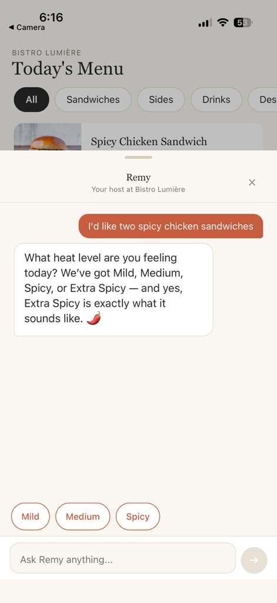

# The Intelligent Bistro

A restaurant ordering experience where a conversational AI handles the cart — on mobile **and** on the web. Built with React Native (Expo), a browser SPA, and a Node.js backend that uses the Anthropic Claude API with structured tool use.

Customers can browse the menu, tap items into the cart, or talk to **Remy**, an in-app AI host who interprets natural language ("I'd like two spicy chicken sandwiches, one mild and one extra spicy") and applies the corresponding cart actions. The cart is always editable from both sides — taps and speech stay in sync against a single Zustand store.

---

## Demo

*Loom walkthrough: [link .*](https://www.loom.com/share/39077188b7b84f41b07468dc2685e2fe)

<p align="center">
  
  
  
</p>

More screenshots: [`docs/screenshots/`](docs/screenshots/).

---

## Stack

| Layer | Choice | Notes |
| --- | --- | --- |
| Mobile | Expo SDK 54, React Native 0.81 | File-based routing via `expo-router` v6 |
| UI | NativeWind v4 (Tailwind for RN) | Plus custom theme tokens (cream `#FAF7F2`, terracotta `#C65D3F`, charcoal `#2C2A26`) |
| State | Zustand | One cart store, one chat store |
| Server data | TanStack Query | Used for `/menu` fetching with caching |
| Animations | `react-native-reanimated` v4 + `react-native-gesture-handler` | Drag-to-dismiss, scale-on-press, animated chat and detail sheets |
| Web | Vanilla JS SPA served by the backend | Same-origin, no build step, XSS-safe DOM rendering |
| Backend | Node.js + Express + TypeScript | Single process: menu, chat, orders, static web app |
| Security | helmet, express-rate-limit, zod | CSP, rate limits, strict input validation, hashed order tokens |
| AI | Anthropic Claude API with **tool use** | Four tools modeling the cart |
| Markdown rendering | `react-native-markdown-display` | For Remy's replies |

No emulators were used during development — the app was tested on physical iOS and Android devices over Expo Go.

---

## Architecture

Three pieces, one data flow:

```
┌─────────────────┐      POST /chat       ┌─────────────────┐
│                 │  { message, cart,     │                 │
│   Mobile (RN)   │    conversationHist } │  Node + Express │
│                 │ ────────────────────▶ │                 │
│  - Menu screen  │                       │  - /menu        │
│  - Cart store   │                       │  - /chat        │
│  - Chat sheet   │ ◀──────────────────── │                 │
│                 │   { reply, actions,   │                 │
└─────────────────┘     suggestions }     └────────┬────────┘
                                                   │
                                          tool use │ Claude API
                                                   ▼
                                          ┌─────────────────┐
                                          │  Claude Sonnet  │
                                          │  4 tools:       │
                                          │  add / remove   │
                                          │  update / clear │
                                          └─────────────────┘
```

Key property: **the cart lives on the client.** The backend is stateless. On every chat request the mobile app sends its current cart, the user's message, and the recent conversation history. The backend embeds the cart into Claude's system prompt for that single request and returns a list of structured `actions` the client then applies to its own Zustand store. This keeps the server simple, makes the system trivially recoverable from a refresh, and means the same cart state powers both UI and AI updates without a sync layer.

---

## The AI integration

This is the part the assessment is really evaluating, so the design choices here are worth a section.

### Tool use, not JSON-mode

Claude's API supports two ways to get structured output:

1. Prompting the model to "return JSON" and parsing the response.
2. **Tool use** — declaring a typed schema for each function the model can call, and getting back validated `tool_use` content blocks.

This project uses tool use. It's the production pattern for a reason: the schema validation is enforced server-side by Anthropic, malformed responses don't surface to your application, and the model is trained to use these tools naturally. You also get a clean separation between Claude's prose (which goes back to the user as a chat reply) and its actions (which mutate the cart).

### The four tools

```ts
add_to_cart({ item_id, quantity, modifiers })
update_quantity({ cart_item_id, quantity })
remove_from_cart({ cart_item_id })
clear_cart()
```

Each is defined as a typed JSON schema in `server/src/chat.ts`. Snake_case on Claude's side (the convention it's trained for), camelCase on the TypeScript side; the mapping happens in one place when actions are returned.

The mobile app's Zustand store has a corresponding `applyAction(action, menu)` method that runs each returned action against the local cart. Because the menu is looked up by `item_id` at apply time, even if Claude misremembers a name slightly, the action only succeeds when the ID exists.

### Why the cart is included in the system prompt every time

Every `/chat` request rebuilds the system prompt with the user's current cart embedded as readable JSON. This is what lets the model handle requests like:

> *"Actually, remove the water."*

without having to guess which `cartItemId` to target. Claude reads the cart inline in the prompt, finds the water, and emits `remove_from_cart({ cart_item_id: "..." })` with the right ID. If we only sent conversation history, the model would either ask back ("which water?") or get it wrong; with cart-in-prompt, multi-turn references to existing items just work.

### Suggestion chips

The `/chat` response includes an optional `suggestions: string[]` array — short phrases the user might tap to continue the conversation. They render as chips at the bottom of the chat sheet (e.g. "Same for both", "Different spice levels", "Surprise me" after Remy asks about spice preference). Tapping a chip just submits its text as the next user message. This keeps the conversation flowing without forcing the user to type, especially helpful for multi-turn modifier prompts.

---

## Getting it running

### Prerequisites

- Node.js 20+
- An Anthropic API key (`sk-ant-...`)
- For mobile: the Expo Go app on your phone, or an iOS Simulator / Android emulator

### 1. Clone and install

```bash
git clone https://github.com/sami-abedi/The-Intelligent-Bistro.git
cd The-Intelligent-Bistro

# Backend
cd server
npm install
cp .env.example .env
# then edit .env and paste your ANTHROPIC_API_KEY

# Mobile
cd ../mobile
npm install
```

### 2. Configure the mobile app's API base URL

In `mobile/lib/api.ts`, the constant `API_BASE_URL` points to the dev server. For Expo Go on a physical device, this needs to be your computer's LAN IP (not `localhost`, which resolves to the phone itself).

Example: `http://192.168.1.42:3000`

### 3. Run the backend

```bash
cd server
npm run dev
```

You should see:

```
Bistro server running on http://localhost:3000
```

### 3b. Open the web app

The backend serves a full browser version of the bistro at the same address:

```
http://localhost:3000
```

Menu, item detail with nutrition, customization, cart, chat with Remy, and a real checkout with a demo payment step — all in the browser, no extra build step. It talks to the same `/menu`, `/chat`, and `/orders` endpoints as the mobile app.

The staff-side kitchen view lives at `http://localhost:3000/kitchen.html` — it asks for the `ADMIN_KEY` from `server/.env`, lists live orders, and lets you advance each order's status (which customers see update in real time on their confirmation screen).

### 4. Run the mobile app

In a separate terminal:

```bash
cd mobile
npx expo start
```

Scan the QR code with Expo Go (Android) or the Camera app (iOS).

### 5. Verify

- Tap the chat FAB. Type `I'd like two spicy chicken sandwiches`. Remy should respond and the cart should populate. The cart count appears at the bottom of the menu.
- Tap a menu card to see the detail sheet with ingredients and nutrition.
- Tap "View cart". You should see line items with images, and a "Place order" button.

---

## Project structure

```
The-Intelligent-Bistro/
├── server/                          # Node.js + Express backend
│   ├── src/
│   │   ├── index.ts                 # Express app: security middleware, /menu /chat /orders, static web app
│   │   ├── chat.ts                  # Claude tool-use loop, system prompt
│   │   ├── orders.ts                # Order creation, server-side pricing, persistence, token auth
│   │   ├── validation.ts            # Zod schemas for every request body
│   │   ├── menu.ts                  # Static menu data (with calories, ingredients, macros)
│   │   └── types.ts                 # Shared types
│   ├── public/                      # Web app (vanilla JS SPA, served same-origin)
│   │   ├── index.html
│   │   ├── styles.css
│   │   └── app.js                   # Menu, cart, chat, checkout — DOM-API rendering only
│   ├── data/                        # orders.json (gitignored, created at runtime)
│   ├── .env.example
│   └── package.json
│
├── mobile/                          # React Native (Expo) app
│   ├── app/                         # expo-router routes
│   │   ├── _layout.tsx              # Root Stack with chat/cart/customize/item-detail routes
│   │   ├── index.tsx                # Menu screen
│   │   ├── chat.tsx                 # 75% bottom-sheet chat (transparentModal)
│   │   ├── cart.tsx                 # Cart modal
│   │   ├── customize.tsx            # Item customization modal
│   │   └── item-detail.tsx          # 75% bottom-sheet item detail with nutrition
│   ├── components/
│   │   ├── MenuItemCard.tsx         # Menu item with + button (and tap-for-detail)
│   │   ├── ChatFAB.tsx              # Floating chat trigger
│   │   ├── ChatBubble.tsx           # Message rendering with Markdown
│   │   ├── ChatInput.tsx            # Send composer
│   │   ├── CategoryChips.tsx        # Filter chips on the menu
│   │   └── ThinkingIndicator.tsx    # Three-dot bubble while Claude thinks
│   ├── stores/
│   │   ├── cartStore.ts             # Zustand cart with applyAction()
│   │   └── useChatStore.ts          # Zustand chat history + thinking state
│   ├── lib/
│   │   └── api.ts                   # fetchMenu, sendChat
│   ├── types.ts
│   └── package.json
│
└── README.md
```

---

## Tradeoffs and decisions

### What we built

- A 75% bottom-sheet chat with drag-to-dismiss and reliable keyboard handling on both iOS and Android
- A `+` button on every menu card for one-tap add (or open customize for items with modifiers)
- A menu item detail sheet (tap a card body) with a larger image, ingredients, and a four-column nutrition row — calories, protein, carbs, fiber
- Customizable items with modifier groups (e.g. spice level for the chicken sandwich)
- Cart with line-item images, quantity controls, and a primary "Place order" button
- Suggestion chips driven by the AI's response
- Three-dot "thinking" indicator while Claude is generating
- A full web version of the app (menu, customize, cart, chat, checkout) served same-origin by the backend
- A real order flow: `POST /orders` prices the cart server-side, persists it, and returns an order id + retrieval token; both clients use it
- A demo payment step (`POST /orders/:id/pay`): card form on web checkout, or "pay at pickup" — the processor is a stub that accepts only the test card `4242 4242 4242 4242` and stores just the last four digits, shaped so a real Stripe-style provider can drop in
- A kitchen view at `/kitchen.html`: staff enter the `ADMIN_KEY`, see live orders (auto-refresh, payment badges), and advance status `received → preparing → ready → completed`; the customer's confirmation screen polls and updates in real time
- Chat retry on both clients: a failed send offers a "↻ Try again" chip instead of a dead end
- Cart persistence on both clients: localStorage on web, AsyncStorage on mobile

### Security

- **Server-side pricing.** Clients send item ids and quantities only. Prices, modifier deltas, tax, and totals are computed from the canonical menu on the server — a tampered client cannot set its own prices, and unknown items, invalid modifiers, or missing required modifiers reject the order.
- **Strict input validation.** Every request body is parsed with `zod` (`server/src/validation.ts`): strict shapes (unknown fields rejected), capped string lengths, capped quantities (≤20), capped cart size (≤30 lines), capped history (≤40 messages, server forwards only the last 20 to Claude).
- **Order tokens.** Each order gets a random 192-bit retrieval token returned exactly once; only its SHA-256 hash is stored, and lookups compare hashes with `crypto.timingSafeEqual`. "Wrong token" and "no such order" return the same 404.
- **Rate limiting.** Global 300 req/15 min, `/chat` 20 req/min, `/orders` 10 req/min per IP — the chat route fronts a paid API, so this also bounds spend.
- **helmet + CSP.** Strict Content-Security-Policy (`script-src 'self'`, no inline scripts), `frame-ancestors 'none'`, and the rest of helmet's headers.
- **Origin policy.** Same-origin and no-Origin (native mobile) requests are allowed; any other browser origin must be allowlisted via `ALLOWED_ORIGINS`.
- **XSS-safe web rendering.** The web app renders exclusively through DOM APIs (`createElement`/`textContent`). Remy's markdown passes through a tiny renderer that emits text/`strong`/`em` nodes — model output is never injected as HTML.
- **No leaked internals.** JSON bodies capped at 100 KB, `x-powered-by` disabled, generic error messages, and the server refuses to boot without `ANTHROPIC_API_KEY` instead of failing at request time.
- **Admin API auth.** Kitchen endpoints require the `ADMIN_KEY` via `x-admin-key` header, compared timing-safe; if the env var is unset the admin API is disabled rather than defaulting open. The kitchen page keeps the key in sessionStorage only.
- **No card data at rest.** The demo payment processor never persists or logs a card number — only the last four digits land in the order record. (It's a stub: only the universal test card is accepted, no real money moves.)

### What we cut

- **A real payment provider.** The payment endpoint and checkout UI are live, but the processor is a demo stub. Swapping in Stripe/Adyen means replacing `processDemoCard()` in `server/src/orders.ts` with an API call (and ideally tokenizing on the client so card numbers never touch this server).
- **Accounts.** Orders are retrievable by id + token rather than tied to a user account; good enough for pickup ordering, and it keeps the server free of password handling.

### Why some specific choices

- **Zustand over Redux / Context.** Cart state needed to be readable from many places (menu, chat, cart, customize, detail) without prop drilling. Zustand's `getState()` outside React makes it easy for the chat `applyAction` loop to mutate the cart in response to AI tool calls without going through the component tree.
- **NativeWind over Tamagui.** Tailwind utility classes are faster to iterate on for someone new to the project. We use a small set of theme tokens for color consistency and lean on Tailwind for everything else.
- **`transparentModal` route over `@gorhom/bottom-sheet`.** We attempted the bottom-sheet library first; on this stack it failed to present reliably. We pivoted to a transparent-modal route that renders a 75%-height sheet with manual drag-to-dismiss via `react-native-gesture-handler` + `react-native-reanimated`. The same pattern now powers both the chat sheet and the item detail sheet — simpler, fewer moving parts, and works in both Expo Go and a future dev build.
- **`useAnimatedKeyboard` over `Keyboard.addListener`.** Android keyboard handling on MIUI was unreliable through React Native's JS `Keyboard` events — the height reported by `keyboardDidShow` didn't match the actual IME inset. Switching to reanimated's `useAnimatedKeyboard` hook (which binds to native `WindowInsetsAnimation.Callback` on Android and UIKit notifications on iOS) gave a single code path that works on both platforms.

---

## AI workflow

Per the assessment brief, AI tools were used heavily during development. They were split across three surfaces by role:

| Tool | Primary use |
| --- | --- |
| **Claude.ai (browser chat)** | Planning, system prompt iteration, multi-step debugging, README drafting. Anywhere a long back-and-forth with a thinking partner was more valuable than direct editing. |
| **Cursor** | Day-to-day editing: writing components, scaffolding files, smaller refactors. Cursor's inline suggestions and chat-with-codebase were the default loop for "I know what I want to change, write it for me." |
| **Claude Code** | Larger or riskier edits: the chat-sheet rebuild, the keyboard-handling escape hatch, the menu card `+` button, the item detail sheet. Claude Code's ability to read multiple files and reason across them was useful when a change touched more than one component. |

Two patterns that emerged:

1. **Plan in chat, execute in Cursor / Claude Code.** Designing the system prompt and tool schemas was done conversationally before any code was written; the final TypeScript landed in one or two passes after the design was clear.
2. **Escalate when in-editor edits stop converging.** Two debugging sessions (the bottom-sheet failure on Day 3, the MIUI keyboard issue on Day 5) burned more time than they should have in Cursor. Both were resolved by writing a careful prompt with constraints and prior attempts listed, then handing off to Claude Code. The lesson: when a fix has been tried 3+ times without working, the problem usually isn't another small edit — it's the wrong approach. A clean prompt to a different surface forces a fresh framing.

Approximate split of code authorship: ~80% AI-generated, ~20% hand-written or hand-edited. Every AI-generated file was read in full before commit; the project does not contain code I haven't reviewed.

---

## Known limitations & next steps

- **Payments are a demo stub.** The flow (create → pay → paid badge in the kitchen) is real, but no actual charge happens. Next step: Stripe with client-side tokenization.
- **Mobile has no payment step.** Mobile orders are placed as pay-at-pickup; the card form currently exists on web only.
- **Kitchen auth is a shared key.** Fine for a single-restaurant demo; a multi-user staff system would want real accounts and roles.
- **The system prompt is hand-tuned.** It works well for the menu and tool set used here, but it isn't evaluation-driven. A more rigorous version would maintain a small suite of conversation tests (`"two sandwiches, one spicy"`, `"actually remove the water"`, ambiguous requests, off-menu items) and run them on every prompt change.
- **No accessibility audit.** Color contrast was chosen for aesthetics; it has not been verified against WCAG, and screen-reader labels are sparse.

---

## License

This project was built as part of a take-home assessment for Viridien. The code is provided as-is for evaluation purposes.
